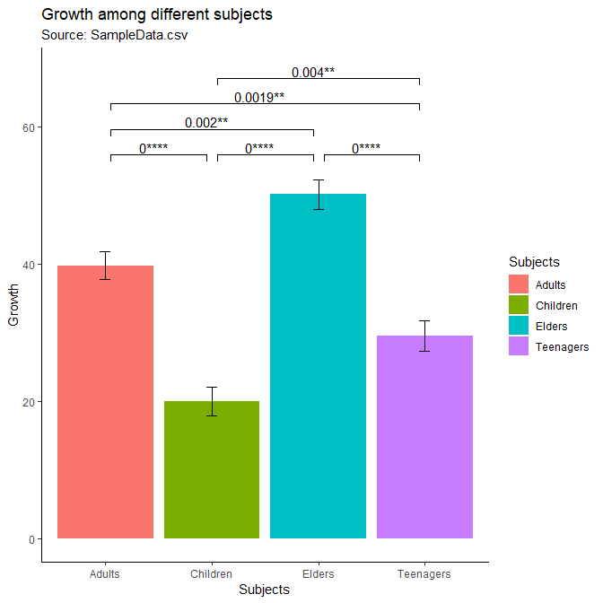
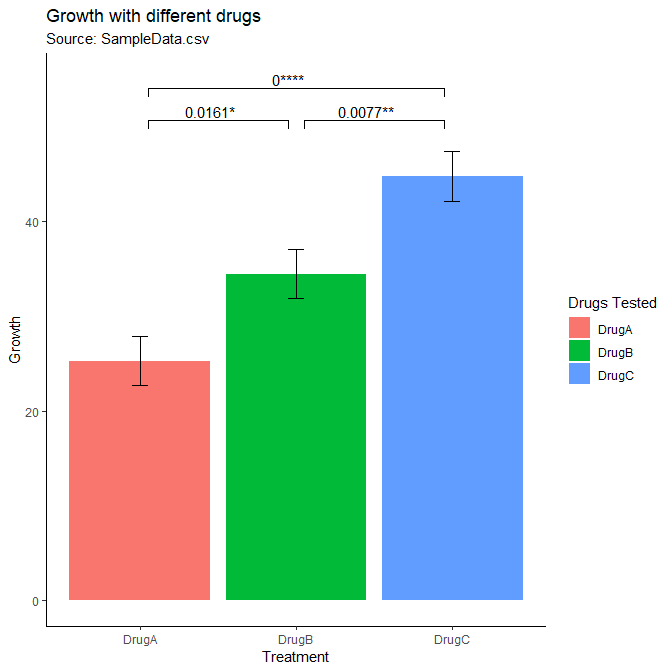
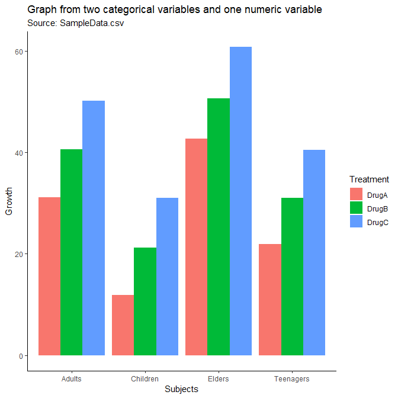

Plot significances on graphs
================

Objective
---------

While working with scientific data, I always have to compute and plot significant differences between two or more datasets. While computing pvalues is pretty easy, plotting them on a graph has always been a tedious process. I have to provide information in the form of annotation to draw lines between bars and add pvalues on top of those lines. I looked for R packages that can do this automatically. Though there are some, but the user has to explicitly input the dataset names for which pvalues have to be plotted.

Since none of the packages could satisfy my needs and as I plot graphs and significances on a daily basis, I therefore decided to write a function that could do this automatically.

System requirements
-------------------

1.  R
2.  RStudio

Install tidyverse package and attach it as described below.

``` r
install.packages("tidyverse", repos = "https://cran.ma.imperial.ac.uk/")
library(tidyverse)
```

Function usage
--------------

I would like to explain the usage of the function with an example.

In my repository, I have provided a sample dataset in "SampleData.csv" file. Import it and modify the data types.

``` r
growth.drug.test <- read_csv(file = "SampleData.csv", col_names = TRUE)
str(growth.drug.test)
growth.drug.test <- growth.drug.test %>%
    mutate(Subjects = as.factor(Subjects)) %>%
    mutate(Treatment = as.factor(Treatment))
```

``` r
head(growth.drug.test)
```

    ## # A tibble: 6 x 3
    ##   Subjects Treatment Growth
    ##   <fct>    <fct>      <dbl>
    ## 1 Children DrugA      10.5 
    ## 2 Children DrugB      19.4 
    ## 3 Children DrugC      29.0 
    ## 4 Children DrugA       9.18
    ## 5 Children DrugB      18.8 
    ## 6 Children DrugC      28.3

This object has three columns:

1.  Subjects
    -   A categorical variable with four levels
2.  Treatment
    -   A categorical variable with three levels
3.  Growth
    -   A numeric variable

The function to plot significances requires the following arguments to be fulfilled:

1.  dataset
    -   a dataframe with only two columns: first should be categorical variable and the second should be numeric varaible
2.  error.bars
    -   specify "sd" for standard deviation or "sem" for standard error of the mean
3.  type
    -   specify "t.test" to perform ttest or "wilcox.text" to perform wilcox test
4.  alternative
    -   specify "two.sided" or "greater" or "less"
5.  conf.level
    -   provide a value between 0 and 1. Example: for a 95% confidence level, use 0.95
6.  title
    -   provide a title for the chart enclosed in double quotes
7.  subtitle
    -   provide a subtitle for the chart enclosed in double quotes
8.  xlabel
    -   provide a label for X-axis enlcosed in double quotes
9.  ylabel
    -   provide a label for Y-axis enclosed in double quotes
10. legend.title
    -   provide a title for the legend enclosed in double quotes

Import the function into your environment

**Note**: Use this function only to draw bar charts. Will not work with other chart types.

### Example 1:

To view the Growth among different Subjects, irrespective of the drug taken:

``` r
plotSignificances(dataset = growth.drug.test[c(1,3)],
                  error.bars = "sem",
                  type = "t.test",
                  alternative = "two.sided",
                  conf.level = 0.95,
                  title = "Growth among different subjects",
                  subtitle = "Source: SampleData.csv",
                  xlabel = "Subjects",
                  ylabel = "Growth",
                  legend.title = "Subjects"
                  )
```



### Example 2:

To view the Growth with different Treatment drugs, irrespective of the Subjects tested:

``` r
plotSignificances(dataset = growth.drug.test[c(2,3)],
                  error.bars = "sem",
                  type = "t.test",
                  alternative = "two.sided",
                  conf.level = 0.95,
                  title = "Growth with different drugs",
                  subtitle = "Source: SampleData.csv",
                  xlabel = "Treatment",
                  ylabel = "Growth",
                  legend.title = "Drugs Tested"
                  )
```



### Example 3:

As mentioned earlier, the function will only work with datasets that have one categorical variable and one numeric variable. It cannot plot significances on graphs (shown below) created from more than one categorical variables and one numeric variable.

``` r
ggplot(data = growth.drug.test,
       aes(x = Subjects, y = Growth, group = Treatment, fill = Treatment)) +
    geom_bar(stat = "identity", position = "dodge") + 
    theme_classic() +
    labs(title = "Graph from two categorical variables and one numeric variable",
         subtitle = "Source: SampleData.csv")
```


